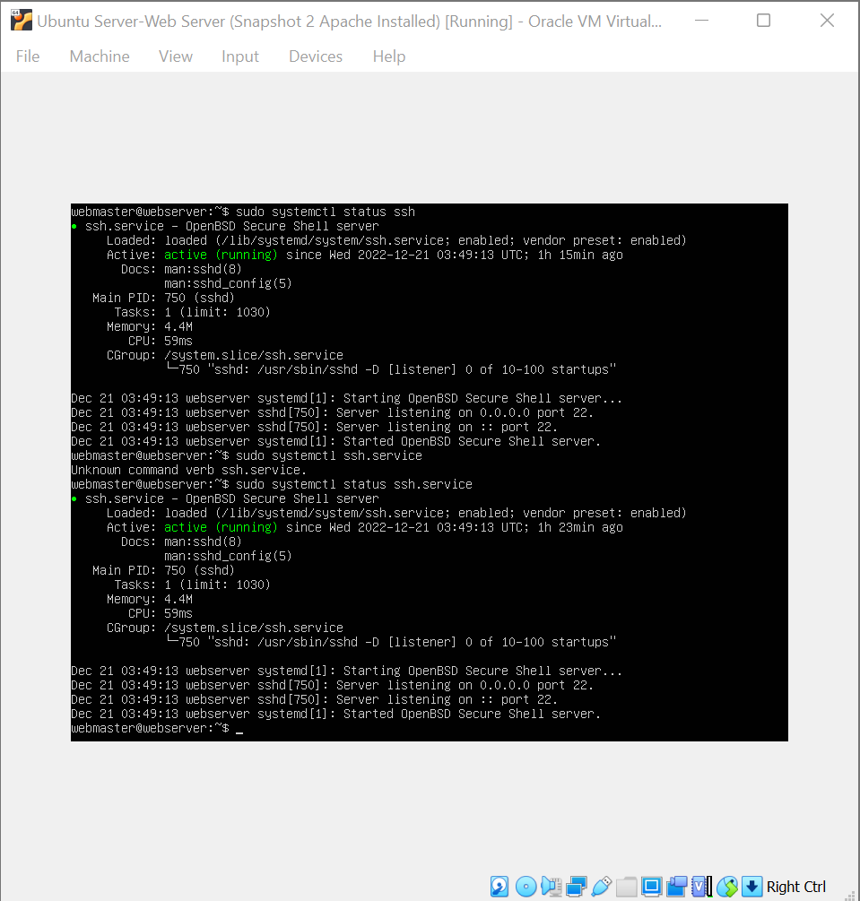
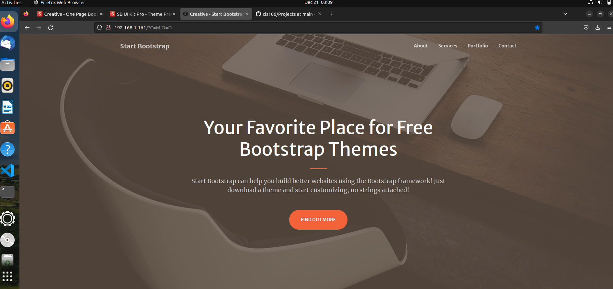
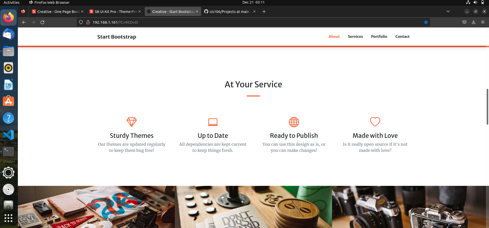
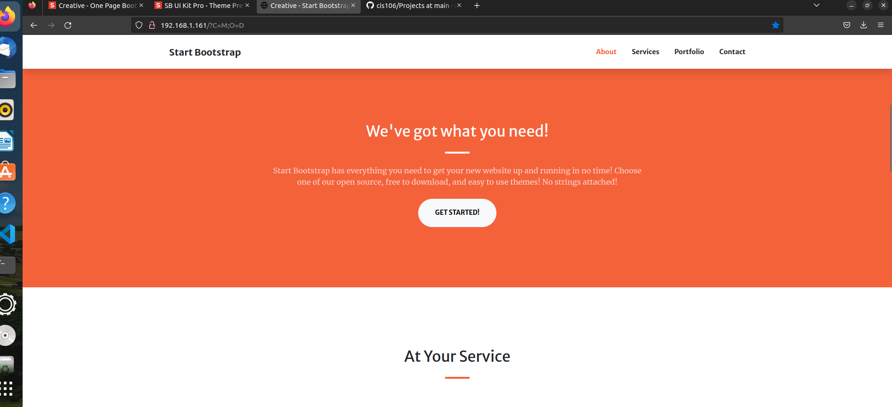

---
Angelo Castillo
Cis 106
12/21/22
---

## Deliverable 2

##### As you can see I installed my ubuntu server and now I can run it to create my website.

##### My server is ready to go and now I can login.

##### As you can see in here, Im displaying all the specs of my vm.

##### Here I ran a status command to make sure that Apache is working properly.

##### After testing my website using my ip address I start to see some progress on my website development.

##### Here I'm checking the status of my ssh.

##### Here I choosed a free website template. I copied the link and using a git command I unzip it and created my website.

##### As you can see my private website is done.

