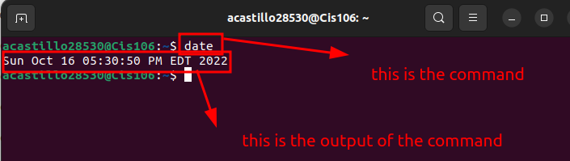

# lab 3 submission

## Question 1

## Question 2

| Program purpose     | Package Name | Version              |
| ------------------- | ------------ | -------------------- |
| Play a tetris game  | blockattack  | 2.7.0-1 amd64        |
| Play a video file   | aview        | 1.3.0rc1-9.1 amd64   |
| Browse the internet | wapua        | 0.06.3-2             |
| Read your email     | geary        | 40.0-2 amd64         |
| Play music          | sidplay      | 2.0.9-6ubuntu6 amd64 |

## Challenge

1. Which command did you use to install?
 
 Just-install

2. Which command did you use to remove?
  
  Apt remove

3. Which command will you use to install and remove?
   
  
 remove pkg1+ pkg2

  
 | command | what it does                                                                                                                   |
   | ------- | ------------------------------------------------------------------------------------------------------------------------------ |
   | echo    | Display a line of text.                                                                                                        |
   | fortune | Print a random, hopefully interesting, adage .                                                                                 |
   | cowsay  | Generates an ASCII picture of a cow saying something provided by the user                                                      |
   | lolcat  | Is a program that concatenates files, or standard input.                                                                       |
   | figlet  | Turns ordinary terminal text into big fancy letters.                                                                           |
   | toilet  | Display large colorful characters                                                                                              |
   | rig     | Rig is an utility that will piece together a random first name, last name and address, along with a geographically consistant. |