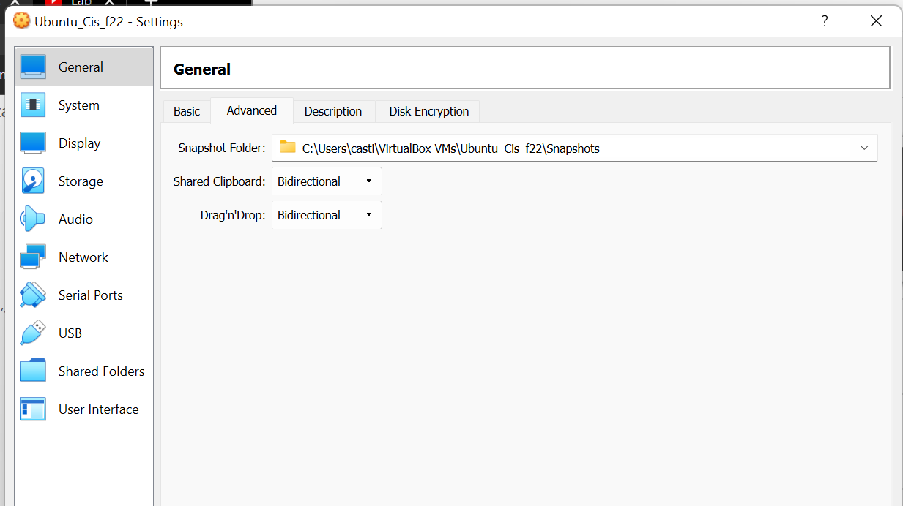

# Week report 2

># The basics of virtualization

## What is virtualization ## 
 Definition of virtualization:

 Virtualization is the replication of hardware to simulate a virtual machine inside a physical machine.

 ## Types of virtualization ##
 # There are two types of virtualization:
 

  >1. Server-side virtualization
  >2. Client-side virtualization
  ### Server-Side virtualization ###
  Definition:
Server side virtualization provide a virtual desktop to each user.
  
 
 
   ### Client-Side virtualization ###
   Definition:
   Desktop virtualization is a very common way to run multiple operating systems on a single desktop. For example, you'd be running Mac OS X, Windows, Linux, and more.
    

  
  

## Installing Ubuntu in virtualbox

