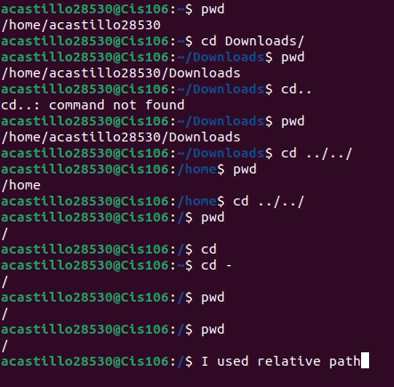

# Week report 4 

## The file system directories

| Directory | Data Stored in Directory                                                           |
| --------- | ---------------------------------------------------------------------------------- |
| bin       | Essential commands.                                                                |
| dev       | Device Files.                                                                      |
| etc       | System configuration files.                                                        |
| home      | User home directories.                                                             |
| media     | Mount point for removable media, such as DVDs and floppy disks.                    |
| opt       | Add-on software packages.                                                          |
| proc      | Kernel information, process control, system hardware information.                  |
| srv       | Information relating to services that run on the system.                           |
| usr       | non essential software for operation.                                              |
| var       | Dedicated to variable data, such as logs, database, websites, and temporary spool. |

## Commands to navigate the file system

| Command | WHat it does                               | Syntax | Example          |
| ------- | ------------------------------------------ | ------ | ---------------- |
| pwd     | Prints current directory.                  | `pwd`  | `pwd`            |
| cd      | Change the current directory               | `cd`   | `cd ~/Downloads` |
| ls      | List the content of the present directory. | `ls`   | `ls -1x`         |

   
   
## Definitions of the following terms

File system: The way files are stored and organized to simplify access to data.

Current directory: Where you are currently working.

parent directory: A directory containing the currents directory.

the difference between your home directory and the home directory: Your home directory is giving to an user. Home directory is the root directory.

pathname: Indicates the locations of a file in the file system.

relative path: The location of a file starting from the the current working directory.

absolute path:The location of a file starting in the root of the system.

A bulleted list of all the commands are used for navigating the filesystem.
1. Pwd
2. Cd
3. Ls
