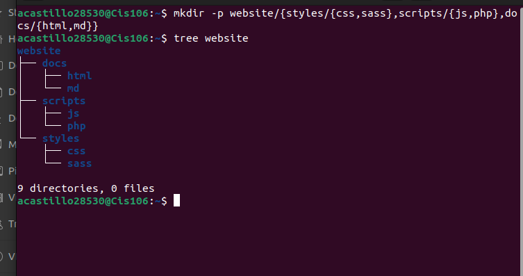
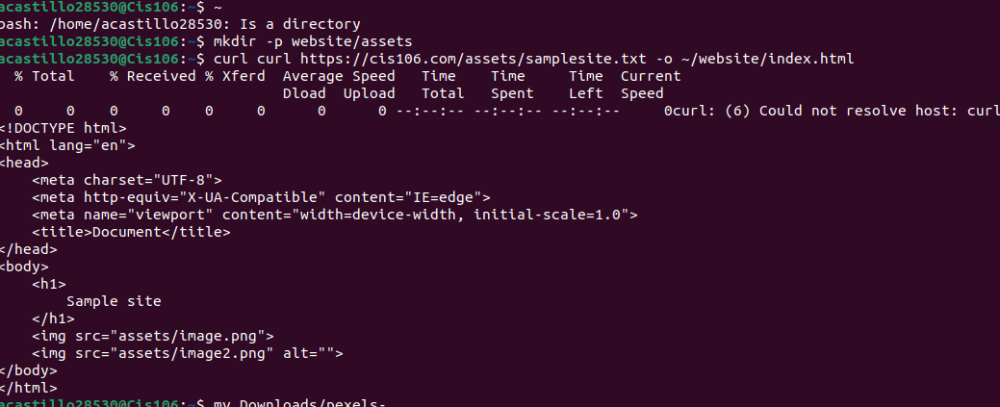

# Week Report #4

# Answers to the following questions:

## What are Command Options?
 A single-letter or full word that modifies the behavior of a command in some predetermined way.

## What are Command Arguments?
Arguments command are parameters that are passed to a script while executing them in the bash shell

## Which command is used for creating directories? Provide at least 3 examples.
The command that we use for creating a directory is the `mkdir` command.
Example:
1. `mkdir` `Downloads`
2. `mkdr` `Wallpaper`
3. `mkdr` `videos`

## What does the touch command do? Provide at least 3 examples.
The touch command is use for creating files.
Example:
1. `touch` `my favorite player.txt`
2. `touch` `the american dream.txt`
3. `touch` `game cheats.txt`

## How do you remove a file? Provide an example.
 For removing a file we use the `rm` command.
 Example:
 1. `rm -I Downloads/gta5`
 2. `rm -I Picture/linuxlogo.png`
 3. `rm -I Music/Bye Bye.mp3`

## how do you remove a directory and can you remove non-empty directories in Linux? Provide an example
To remove a directory that is not empty, we  use the rm command with the -r. Yes we can remove a non-empty directory.
`-r/music`

## Explain the mv and cp command. Provide at least 2 examples of each
`mv` Moves and renames directories. `cp` move files/directories from a source to a destination.
Example:
1. `mv` `Downloads/cis106hw5.docx Documents/cis106weekreports5.docx`
2. `cp` `homework5/Documents`

## Complete all the Practices in the Presentation:

  
 