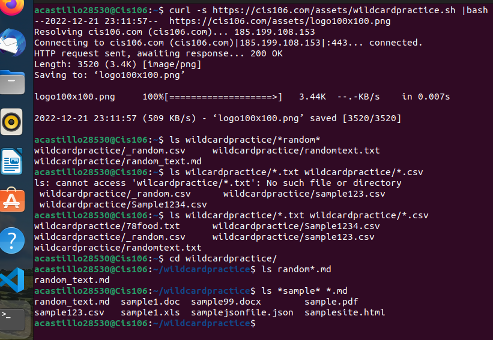
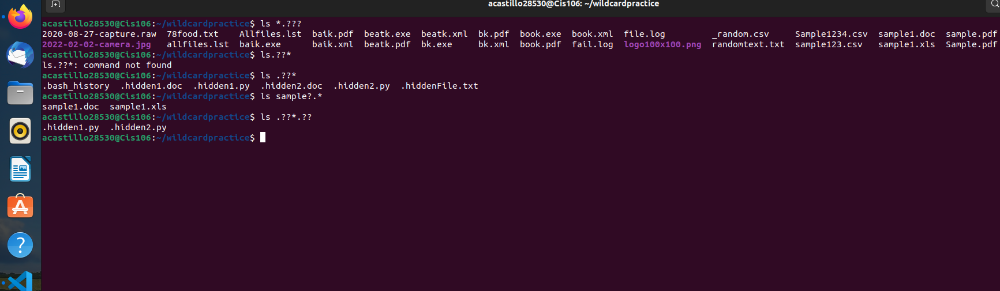
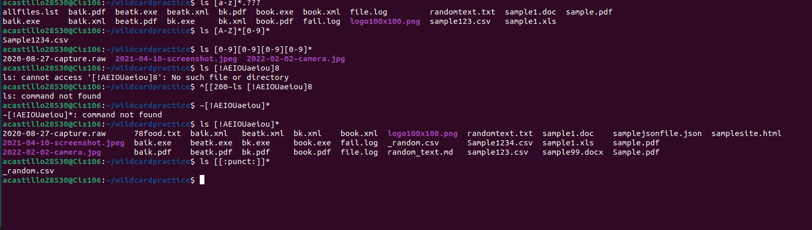

---
Angelo Castillo
Cis 106
12/21/2022
---

# Week Report 6

## Wildcards.

### * Wildcard 

The `*` matches any number of characters. You can use the asterisk (*) anywhere in a character string.
 Example:
 List all pictures in a directory.
 `ls *.png`
 Here we can see in the result that files starting with A and ending with F.
 `ll A*f`
 Any file that begins with the letter 'B'
 `ls B*`
 Copy all the MP4 files
`cp Downloads/*.mp4 ~/Videos/Movies/`
 
  ### ? Wildcard

 The ? wildcard metacharacter matches precisely one character. 
 * Example:
 Any file that begins with list followed by 1 character.
 `ls List?`
 Any file that begins from a range of a-d and followed by exactly 2 character.
 `ls [a-d]??`
 Any file that begins with the letter 'b' followed by exactly two characters and ending with 'y'.
 `ls B??y`
 To List all hidden Files

 ### The [] Wildcard

 The brackets wildcard match a single character in a range.
 * Example:
 To match all the files that have numbers after letter A
 `ls A[0-9]*`
 Find file start with a particular character and is followed by another character.
 `ls [afgh]*o*`
 Finding file that contain the name, 'car' and the extension contains any character from a to x.
 `ls car.[a-x]*`

### Brace Expansion

The {} Expansion allow you to generate arbitrary strings to use with commands.
* Example:
   Create a whole directory.
 `mkdir -p Music/{Bachata,Rap}`
 For removing a directory using the brace command
 `rm -r {dir1,dir2,picture.png,file.txt}`

# Practice

## Practice 5

## Practice 6

## Practice 7
